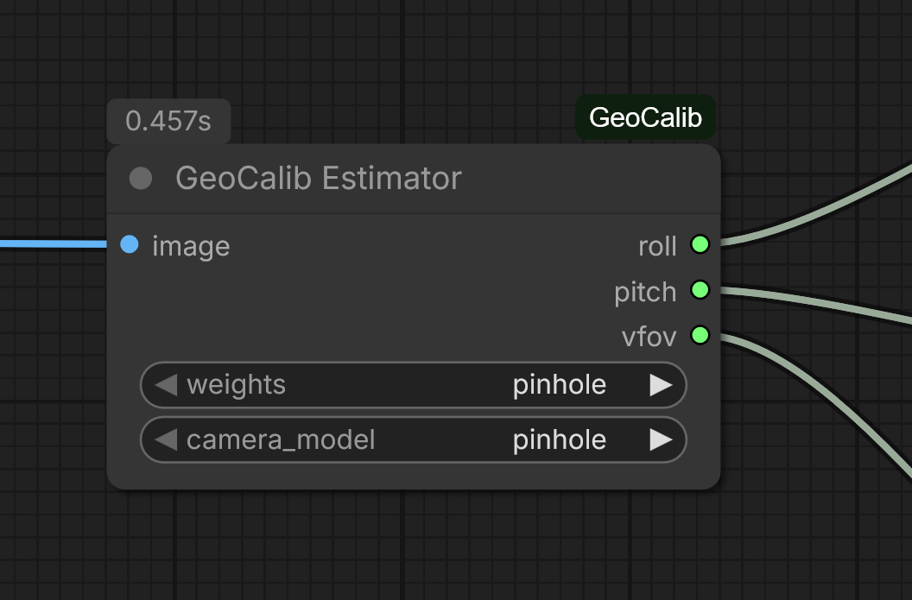
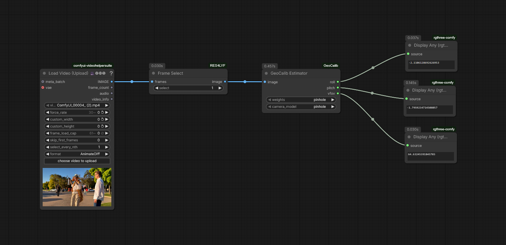

# ComfyUI-GeoCalib

A Custom Node for [ComfyUI](https://github.com/comfyanonymous/ComfyUI) that implements **GeoCalib** to estimate camera intrinsics from a single image.

This node allows you to extract the **Roll**, **Pitch**, and **Vertical Field of View (vFoV)** from any input image or video frame. It uses the Geometric Calibration model presented at ECCV 2024.





## Features
* **Automatic Calibration:** Estimates camera parameters from a single image.
* **Camera Models:** Supports `pinhole`, `simple_radial`, and `simple_divisional` models.
* **Lens Weights:** Choose between `pinhole` (standard) and `distorted` (fisheye/wide) pre-trained weights.
* **Outputs:** Returns float values for `roll`, `pitch`, and `vfov` (in degrees) that can be pipe to other nodes (e.g., for controlling 3D rotations or conditioning).

## Installation

### Method 1: ComfyUI Manager (Recommended)
1.  Open ComfyUI Manager > Custom Nodes
2.  Search for `GeoCalib`.
3.  Click **Install**.
4.  Restart ComfyUI when prompted.

### Method 2: Manual Installation
1.  Navigate to your ComfyUI `custom_nodes` directory.
2.  Clone this repository:
    ```bash
    git clone https://github.com/Antilopax/ComfyUI-GeoCalib.git
    ```
3.  Install dependencies:
    ```bash
    cd ComfyUI-GeoCalib
    pip install -r requirements.txt
    ```
    *Note: This will install the `geocalib` library directly from its GitHub repository.*

## Usage

[Download Example Workflow](workflows/GeoCalib.json)

1.  Add the node via `Add Node > GeoCalib > GeoCalib Estimator`.
2.  Connect an **IMAGE** input.
3.  Select your settings:
    * **weights:** Use `pinhole` for standard photos/videos (phones, DSLRs). Use `distorted` for wide-angle/GoPro footage.
    * **camera_model:** `pinhole` is usually sufficient. If the estimated horizon is shaky, try `simple_radial`.
4.  Connect the **FLOAT** outputs (`roll`, `pitch`, `vfov`) to your workflow.

### First Run Note
The first time you run this node, it will download the necessary model weights from HuggingFace. This may take a minute or two depending on your internet connection. Check your console for progress.

## Inputs & Outputs

| Input | Description |
| :--- | :--- |
| **image** | The input image or batch of images to analyze. |
| **weights** | `pinhole`: Standard lenses.<br>`distorted`: Wide FOV / Fisheye lenses. |
| **camera_model** | Mathematical model for the camera (`pinhole`, `simple_radial`, `simple_divisional`). |

| Output | Description |
| :--- | :--- |
| **roll** | Camera rotation around the Z-axis (in degrees). |
| **pitch** | Camera rotation around the X-axis (in degrees). |
| **vfov** | Vertical Field of View (in degrees). |

## Credits

This node is a wrapper around the official implementation of **GeoCalib**.

**Paper:** [GeoCalib: Learning Single-image Calibration with Geometric Optimization (ECCV 2024)](https://arxiv.org/abs/2402.12345)  
**Original Repo:** [cvg/GeoCalib](https://github.com/cvg/GeoCalib)  
**Authors:** Alexander Vakhitov, Luis Keser, Gabriel Zeller, Dannis G. T. H., Friedrich Fraundorfer.


Please cite the original paper if you use this for research.

